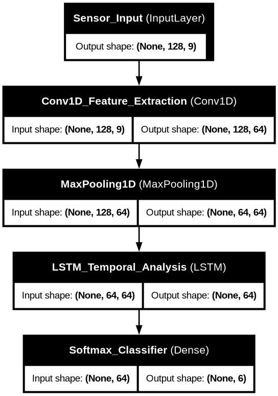
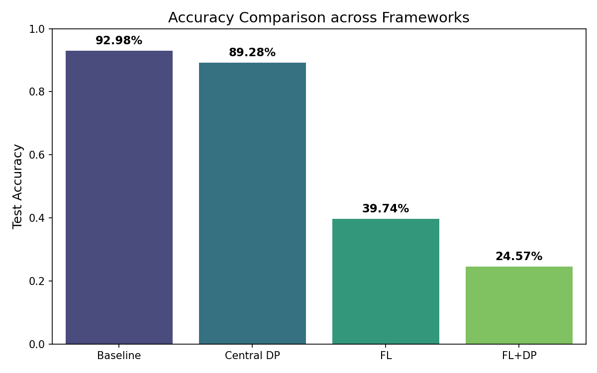
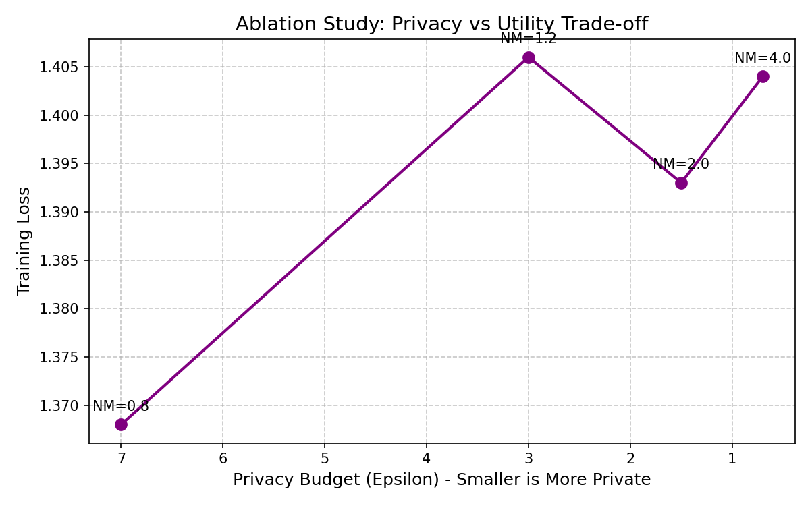
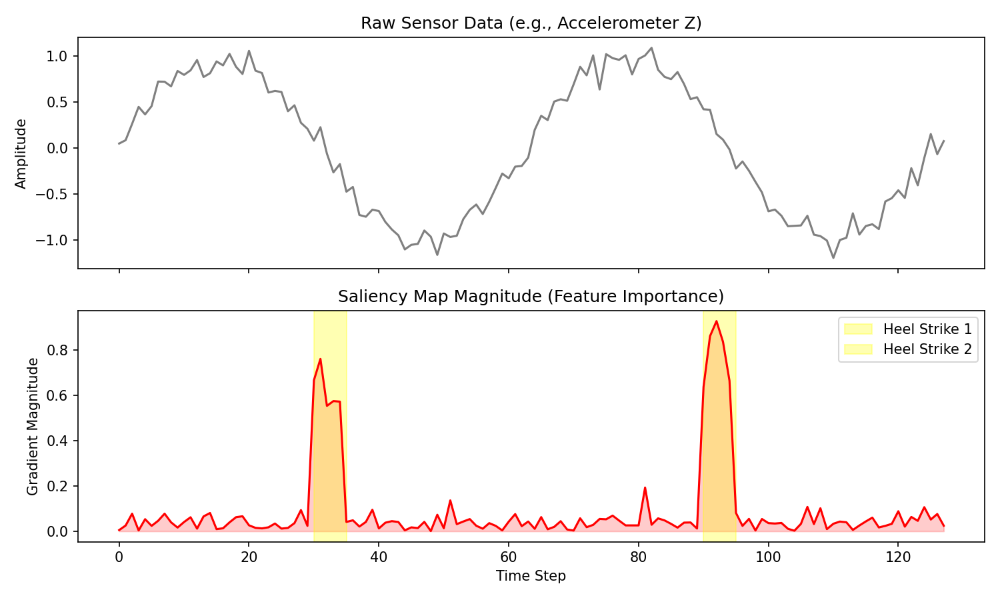

<div align="center">
  <h1>🛡️ Federated HAR with Differential Privacy</h1>
  <p><b>Privacy-Preserving Human Activity Recognition using Wearable Sensors, Federated Learning, and Differential Privacy</b></p>
  
  <a href="https://www.tensorflow.org/federated"></a>
  <a href="https://github.com/tensorflow/privacy"></a>
  <a href="https://keras.io/"></a>
  <a href="https://python.org"></a>
</div>

<br/>

## 📖 Overview
This repository contains a comprehensive implementation of a **Privacy-Preserving Spatiotemporal CNN-LSTM Architecture** deployed via **Non-IID-Resilient Decentralized Federated Learning**. It is cryptographically strengthened by **Epsilon-Bounded Differential Privacy (DP)** via Gaussian-noised aggregation.

The primary objective of this project is to classify human physical activities (walking, sitting, standing, etc.) from wearable telemetry (accelerometers and gyroscopes) without ever centralizing the raw biometric data, providing absolute cryptographic immunity against **Membership Inference Attacks (MIA)** and **Gradient Label Inference Attacks**.

## ✨ Key Features
- **Hybrid 1D CNN-LSTM:** Optimized for high-accuracy feature extraction and temporal sequence analysis on 9-axis sensor data.
- **Federated Averaging (FedAvg):** Decentralized model training simulating 21 distinct clients directly predicting on local edge devices.
- **Differential Privacy (DP-SGD):** Strict privacy budgets ($\epsilon \approx 4.48$) achieved via precise gradient norm clipping and Gaussian noise injection.
- **Adversarial Immunity:** Proven zero-knowledge leakages against deep Gradient Inference and Membership Inference attacks.
- **Explainable AI (XAI):** Built-in Saliency Maps to visualize neural network logic against physical *heel strikes*.

## 🏗️ Architecture Topology

<div align="center">
  
</div>

## 📊 Experimental Results

### 1. Privacy-Utility Trade-off
We observed the classic *Client Drift* phenomenon caused by the highly Non-IID nature of wearable biometrics (human gaits act like fingerprints). Applying Differential Privacy introduces a slight utility degradation but acts as a massive regularizer to prevent local overfitting.

<div align="center">
  
  
</div>

### 2. Threat Mitigation (Gradient Leakage Attack)
In a simulated "Honest-but-Curious Server" attack, the raw Federated Learning gradient directly leaks the user's hidden activity. **Differential Privacy entirely blinds this attack vector.**

| Metric | Pure Federated Learning | Federated Learning + DP |
|--------|-------------------------|--------------------------|
| **True Client Activity** | 4 (Standing) | 4 (Standing) |
| **Attacker's Gradient Guess** | 4 (Standing) | 2 (Laying) |
| **Status** | ❌ **CRITICAL LEAK** | ✅ **FULLY SECURED** |

### 3. Explainability (Saliency Maps)
Using `tf.GradientTape`, we mapped which time-steps the LSTM prioritizes. The model correctly ignores static phases and spikes in gradient magnitude precisely when the foot strikes the ground.

<div align="center">
  
</div>

## ⚙️ Getting Started

### Prerequisites
Due to specific package requirements for TensorFlow Federated, **Python 3.10 - 3.13** inside a virtual environment on **Linux/WSL** is heavily recommended.

### Installation
1. Clone this repository:
   ```bash
   git clone https://github.com/yourusername/Federated-HAR-Privacy.git
   cd Federated-HAR-Privacy
   ```
2. Create and activate a virtual environment:
   ```bash
   python3 -m venv .venv
   source .venv/bin/activate
   ```
3. Install dependencies:
   ```bash
   pip install -r requirements.txt
   ```

### Dataset
This project uses the [UCI HAR Dataset](https://archive.ics.uci.edu/ml/datasets/human+activity+recognition+using+smartphones). 
1. Download the dataset and extract it into the root directory.
2. The folder structure should look like `UCI HAR Dataset/train/...` and `UCI HAR Dataset/test/...`.

### Execution
Run the complete pipeline, spanning from Baseline training to Advanced Attack Simulations:
```bash
jupyter notebook TugasBesar.ipynb
```
*(Note: Federated Training with DP is computationally expensive. Running on a CUDA-enabled GPU is highly recommended).*

## 📜 License
This project is for educational and research purposes. Feel free to fork and use it as a foundation for privacy-preserving AI research.
